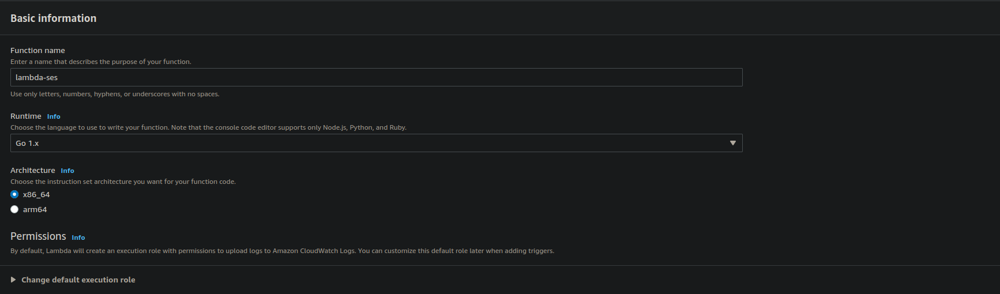

# Lambda SES

A simple lambda function that allows access to the AWS SES V2 API from AWS Lambda, which is definetly not to use the free 62 000 emails a month.

## Installing node-client

```sh
npm i talentmaker/lambda-ses#semver:<version>
pnpm add talentmaker/lambda-ses#semver:<version>
yarn add talentmaker/lambda-ses#semver:<version>
```

E.G

```sh
pnpm add talentmaker/lambda-ses#semver:^1.0.0
```

## Examples

### node-client with SDK V3

```js
import { LambdaClient } from "@aws-sdk/client-lambda";
import { LambdaSes } from "lambda-ses";

const config = {
    credentials: {
        accessKeyId: process.env.AWS_ACCESS_KEY_ID,
        secretAccessKey: process.env.AWS_SECRET_ACCESS_KEY,
    },
    apiVersion: "2022-01-10",
    region: "us-east-1",
};

const lambda = new LambdaClient(config);
const lambdaSes = new LambdaSes(lambda, "lambda-ses");

lambdaSes.send({
    email: {
        from: "luke_zhang_04@protonmail.com",
        dest: {
            to: ["luke_zhang_04@protonmail.com"],
        },
        content: {
            simple: {
                body: {
                    html: {
                        charset: "UTF-8",
                        data: "<h1>Hello!</h1><br/><p>This is a message</p>",
                    },
                },
                subject: {
                    charset: "UTF-8",
                    data: "no",
                },
            },
        },
    },
});
```

### CLI V2

Make sure `cli_binary_format=raw-in-base64-out`

```json
{
    "email": {
        "from": "luke_zhang_04@protonmail.com",
        "dest": {
            "to": ["luke_zhang_04@protonmail.com"]
        },
        "content": {
            "simple": {
                "body": {
                    "html": {
                        "charset": "UTF-8",
                        "data": "<h1>Hello!</h1><br/><p>This is a message</p>"
                    }
                },
                "subject": {
                    "charset": "UTF-8",
                    "data": "no"
                }
            }
        }
    }
}
```

```bash
aws lambda invoke --function-name "lambda-ses" --payload "$(cat ./email.json)" /dev/stdout
```

## Uploading to AWS

1. Build with docker

```sh
docker build -t ses .
docker container create --name temp ses
docker container cp temp:/go/src/github.com/talentmaker/lambda-ses/lambda-ses .
docker container rm temp
```

3. Create Lambda Function



2. Upload to AWS

```sh
zip lambda-ses.zip lambda-ses
aws lambda update-function-code --function-name lambda-ses --zip-file fileb://lambda-ses.zip
```
